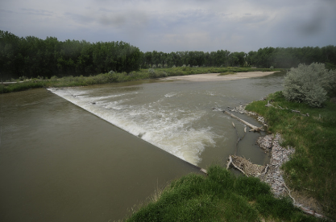

# AguaIA

Find a way to predict the state of water (stage and discharge) at any time in the future using ML, sensor data and photographs of water bodies.

## Corrections
We had different learning opportunities during the semester, on several occasions we had feedback from the professors where they pointed out different points to improve in our work trying to be as precise as possible.

One of the main points to improve was the presentation of our results, they recommended us to make a more detailed explanation of the processes and steps that we followed in order to reach these results. These observations were taken into account in the final presentation of our work where we paid more attention to the delivery of results, trying to be more precise and clear about the steps and processes that we follow to look for solutions.

We also had conversations about the models when analyzing images looking for solutions, we worked with models created by us and we were recommended to have a point of comparison using ready-made models such as vgg16 or resnet looking to improve our own models. This was important because we had benchmarks where we could compare our models and we improved with each iteration.

